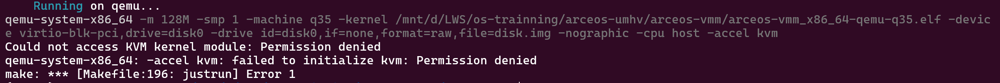
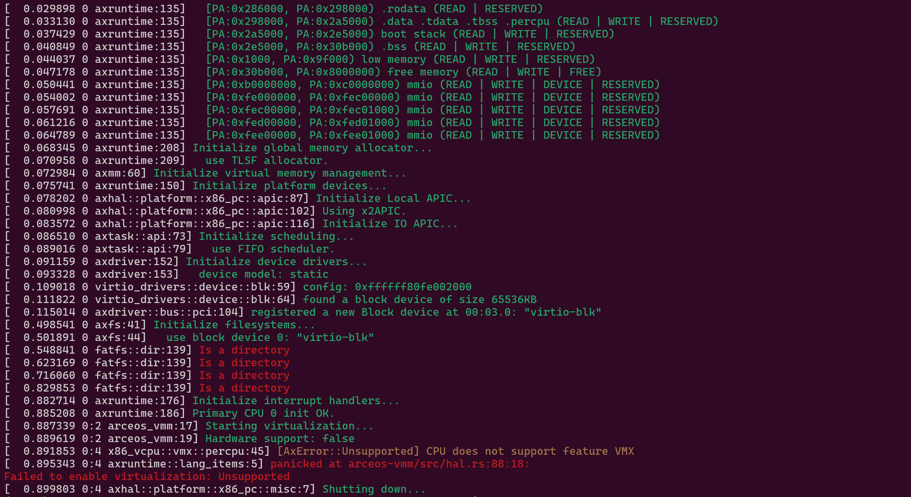
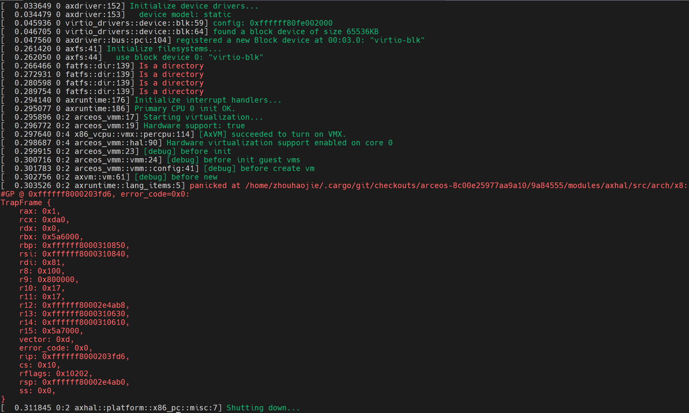
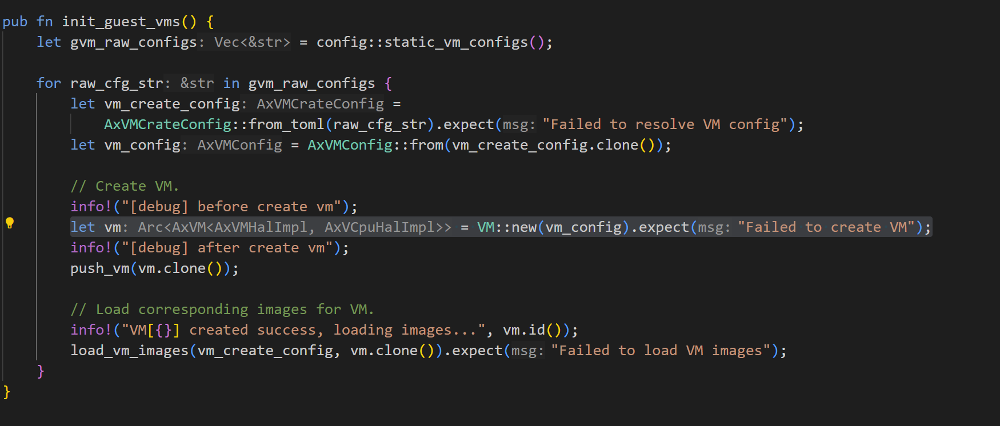
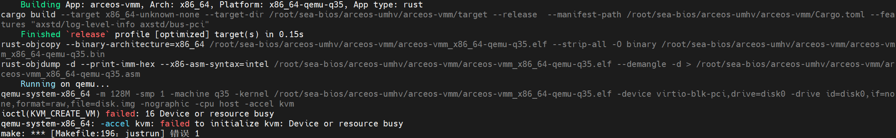
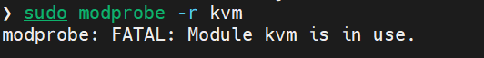

# SeaBIOS

## TODO

- [x] 阅读 arceos-vmm 源码
- [x] 在 arceos-vmm 中成功运行基于 rvm-bios 的 nimbos-x86_64
- [ ] 学习 x86_64 体系结构下操作系统的的启动过程
- [ ] 学习 SeaBIOS
- [ ] 在 arceos-vmm 中成功运行 SeaBIOS
- [ ] 在 arceos-vmm 中成功运行基于 SeaBIOS 的 nimbos-x86_64
- [ ] 在 arceos-vmm 中成功运行基于 SeaBIOS 的 Linux

[TOC]

## 12月

### 4日

#### 编译 Guest OS

``` shell
cd guest/nimbos/kernel
make user
make GUEST=on
```

#### 编译 Guest BIOS

``` shell
cd guest/bios
make
```

#### 构建文件系统镜像

``` shell
cd arceos-vmm
make disk_img
mkdir -p tmp
sudo mount disk.img tmp
sudo cp /PATH/TO/OS/IMAGE tmp/
sudo cp /PATH/TO/BIOS tmp/
sudo umount tmp
```

#### 编译运行 Hypervisor

``` shell
cd arceos-vmm

# x86_64
make ACCEL=y ARCH=x86_64 [LOG=warn|info|debug|trace] VM_CONFIGS=/PATH/TO/CONFIG/FILE run

# aarch64
make ACCEL=n ARCH=aarch64 [LOG=warn|info|debug|trace] VM_CONFIGS=/PATH/TO/CONFIG/FILE run

# riscv64
make ACCEL=n ARCH=riscv64 [LOG=warn|info|debug|trace] VM_CONFIGS=/PATH/TO/CONFIG/FILE run
```

### 5日

#### arceos-vmm 启动过程

1. 检测是否有硬件支持（Intel VMX）。
2. 启用虚拟化。
   1. 为每个 CPU 核心初始化亲和性。
   2. 为每个 CPU 核心启用硬件虚拟化支持（可选）。
   3. 阻塞，直到所有核心完成上述操作。
3. 初始化 Guest 虚拟机。
   1. 根据配置文件创建虚拟机实例。
   2. 为创建的虚拟机实例加载指定的虚拟机镜像。
   3. 为每个虚拟机设立 primary vCPU（通常为 vCPU list 中的第一个），并初始化等待队列和任务列表。
4. 启动 Guest 虚拟机。
   1. 遍历 vm_list，启动每个虚拟机。
   2. 当所有虚拟机都停止时，退出 VMM.

#### 启动 arceos-umhv 时无权限访问 kvm

启动 ArceOS-umhv 时出现如下错误：



原因是权限问题，可将当前用户添加到 `kvm` 组中：

``` shell
sudo usermod -aG kvm $USER
newgrp kvm
```

结果，成功启动了 qemu，但是提示 CPU 不支持 VMX，疑似是因为我的 CPU 是 AMD 的？



### 6日

#### 为什么 qemu 模拟 RISC-V 启动基于 OpenSBI，而模拟 x86 启动则基于 SeaBIOS？

> - *generated by GPT4o*
>
> **OpenSBI** 和 **SeaBIOS** 是两种完全不同的系统软件，分别针对不同架构和虚拟化需求，在系统启动流程中扮演不同的角色。它们的主要区别在于适用的架构、功能和设计目标。
>
> ------
>
> ### **1. OpenSBI 与 SeaBIOS 简介**
>
> #### **OpenSBI**
>
> - **全称**：Open Supervisor Binary Interface
> - **适用架构**：RISC-V
> - 作用：
>   - 为 RISC-V 提供运行时的基础支持，包括特权模式（M 模式和 S 模式）之间的转换。
>   - 提供实现平台功能的 SBI（Supervisor Binary Interface）接口，使操作系统能够访问硬件资源（如定时器、中断控制器等）而无需直接操作硬件。
>   - 是 RISC-V 架构启动流程的一部分，通常作为固件的一部分引导操作系统（如 Linux）。
> - 启动过程：
>   1. 系统上电后执行 ROM（引导阶段）。
>   2. ROM 加载 OpenSBI 或其他引导程序。
>   3. OpenSBI 初始化硬件环境并加载操作系统内核。
>
> #### **SeaBIOS**
>
> - **全称**：SeaBIOS
> - **适用架构**：x86 和 x86_64
> - 作用：
>   - 作为传统 BIOS 的开源实现，提供对硬件的基本初始化和启动支持。
>   - 为虚拟机或物理硬件提供 Legacy BIOS 启动服务，可以引导传统的操作系统（如 DOS、Linux、Windows 等）。
>   - 在 QEMU 中，SeaBIOS 通常用作 PC 兼容系统的固件，模拟硬件 BIOS。
> - 启动过程：
>   1. BIOS 初始化硬件。
>   2. 执行引导加载器，加载操作系统。
>   3. 将控制权交给操作系统。
>
> ------
>
> ### **2. 二者的主要区别**
>
> | **特性**       | **OpenSBI**                            | **SeaBIOS**                              |
> | -------------- | -------------------------------------- | ---------------------------------------- |
> | **架构支持**   | 仅支持 RISC-V                          | 仅支持 x86 和 x86_64                     |
> | **功能**       | 提供 SBI 接口和硬件抽象                | 提供传统 BIOS 的功能（硬件初始化、引导） |
> | **目标**       | 为 RISC-V OS 提供固件支持              | 为 x86 系统提供 Legacy BIOS 启动服务     |
> | **引导模式**   | 支持 RISC-V 特权模式转换，启动操作系统 | 启动操作系统，通常用于传统 x86 虚拟机    |
> | **虚拟化支持** | 为 RISC-V 平台的虚拟机提供固件接口     | 通常作为 QEMU x86 虚拟机的默认 BIOS      |
> | **实现复杂度** | 更加轻量化，专注于特定 RISC-V 平台需求 | 传统 BIOS 功能更复杂，兼容性更强         |
>
> ------
>
> ### **3. 为什么 RISC-V 使用 OpenSBI 而 x86 使用 SeaBIOS？**
>
> #### **RISC-V 使用 OpenSBI**
>
> 1. **架构需求**：
>    - RISC-V 的设计强调模块化，硬件平台的具体实现依赖 SBI 接口。
>    - OpenSBI 是 RISC-V 的标准实现，负责在硬件和操作系统之间提供抽象层。
>    - 它能适配不同的硬件平台，而无需操作系统修改。
> 2. **特权模式管理**：
>    - OpenSBI 管理从机器模式（M 模式）到监督模式（S 模式）的切换，帮助操作系统直接运行在监督模式上。
> 3. **简化操作系统设计**：
>    - 操作系统不需要直接控制硬件，而是通过 OpenSBI 提供的接口与硬件交互。
>
> #### **x86 使用 SeaBIOS**
>
> 1. **历史兼容性**：
>    - x86 平台从早期 PC 开始就使用 BIOS，SeaBIOS 是传统 BIOS 的开源实现，提供了与早期 BIOS 一致的接口。
>    - 对于大多数操作系统（如 Windows 或传统 Linux），SeaBIOS 提供熟悉的启动环境。
> 2. **硬件抽象层**：
>    - x86 架构的复杂性较高，SeaBIOS 负责初始化硬件并提供传统 BIOS 中断服务，使得操作系统能够在虚拟化环境中无缝运行。
> 3. **现代替代方案**：
>    - 尽管 SeaBIOS 广泛用于 x86 的 QEMU 虚拟机，但 UEFI（Unified Extensible Firmware Interface）逐渐取代了传统 BIOS，用于现代系统。
>
> ------
>
> ### **4. 总结：二者的定位与用途**
>
> - **OpenSBI** 是为 RISC-V 设计的，专注于硬件抽象和特权模式切换。它更适合轻量级、模块化的 RISC-V 生态。
> - **SeaBIOS** 是为 x86 设计的传统 BIOS 实现，兼容性广泛，但较为笨重。
>
> 在 QEMU 模拟中，RISC-V 平台会用 OpenSBI 提供基本支持，而 x86 平台默认使用 SeaBIOS 提供传统的 BIOS 环境。

#### x86_64 体系结构下操作系统的启动

1. 硬件初始化
   1. 当系统上电时，CPU 硬件电路进入复位状态。
   2. 所有寄存器被设置为默认值，特别是：`cs = 0xf000`，`ip = 0xfff0`。
   3. 意味着 CPU 会从物理地址 `0xffff0` 开始执行代码，这是 BIOS 的入口点（BIOS 固件通常被映射到内存的高地址空间：如 `0xf0000`（16 位）或者 `0xffff0000`（32 位））。
2. BIOS 执行
   1. BIOS 首先执行电源自检，检查基本硬件（如 CPU、内存等）的功能是否正常。
   2. 初始化芯片组、时钟、内存控制器等设备，并设置中断向量表（地址 `0x000 ~ 0x3ff` ）。
   3. BIOS 检查启动设备的顺序，并读取第一个启动设备的主引导记录（MBR，位于磁盘的第一个扇区，512 字节大小）。
3. MBR 加载与执行
   1. MBR 的前 446 字节通常存放 Bootloader 代码，CPU 将 MBR 加载到内存地址 `0x7c00` 并跳转执行。
   2. 紧接着的 64 字节存放分区表，用于描述磁盘的分区布局，Bootloader 根据分区表找到活动分区，并继续加载更高级的引导代码。
4. 引导加载程序（Bootloader）
   1. 第一阶段 Bootloader 通常是一个简单的程序，主要任务是加载第二阶段的引导程序或操作系统内核。
   2. 将 CPU 从实模式切换到保护模式（通过设置 `CR0` 的 PE 位）。
   3. 读取操作系统内核镜像文件（如 Linux 的 `vmlinuz` 或 Windows 的 `ntoskrnl.exe`），将其加载到内存中。
5. 操作系统初始化
   1. 如果内核被压缩，加载器会先解压到指定的内存位置。
   2. 操作系统内核初始化硬件抽象层（HAL），配置 CPU 的特权模式、分页机制以及终端处理。
   3. 操作系统启动第一个用户进程（如 Linux 中的 `init` 或 `systemd`），初始化用户态环境（例如加载驱动程序、挂载文件系统等）。

### 7日

#### 继续尝试成功启动 arceos-umhv

通过重定向方式确定 qemu 运行的参数如下：

``` shell
qemu-system-x86_64 \
-m 128M \
-smp 1 \
-machine q35 \
-kernel /mnt/d/LWS/opencamp/arceos-umhv/arceos-vmm/arceos-vmm_x86_64-qemu-q35.elf \
-device virtio-blk-pci,drive=disk0 \
-drive id=disk0,if=none,format=raw,file=disk.img \
-nographic \
-cpu host \
-accel kvm
```

根据群里的解答，应该是当前版本不支持 AMD 的虚拟化的原因，故尝试转用 Intel Linux 服务器。

但却遇到了奇怪的 panic：



利用 `info!` 进行 debug 追踪，发现错误出现在 `let vm = VM::new(vm_config).expect(...)` 这一句，尝试多种方法也无果，原因不明。



### 8日

#### 继续尝试成功启动 arceos-umhv

换到学校 59 机器上进行测试，报错提示：设备或资源繁忙。



尝试卸载 KVM 模块并重新加载，发现 KVM 基础模块无法被卸载：



查询 Google 相关资料，发现是与 VirtualBox 相关的进程冲突，尝试 kill 掉这些进程后，运行，发现遇到了和昨天一样的 panic。

最终放弃环境配置，选择和队友共用环境。

### 9日

#### 基本的 MBR 程序

``` assembly
; 主引导程序
; ---------------------------------------------------------------------
SECTION MBR vstart=0x7c00
	mov ax, cs
	mov ds, ax
	mov es, ax
	mov ss, ax
	mov fs, ax
	mov sp, 0x7c00

; 清屏利用 0x06 号功能，上卷全部行，即可清屏
; ---------------------------------------------------------------------
; INT 0x10	功能号：0x06	功能描述：上卷窗口
; ---------------------------------------------------------------------
; 输入：
; AH 功能号 = 0x06
; AL = 上卷的行数（若为 0，表示全部）
; BH = 上卷行属性
; (CL, CH) = 窗口左上角的 (X, Y) 位置
; (DL, DH) = 窗口右下角的 (X, Y) 位置
; 无返回值
	mov ax, 0x600
	mov bx, 0x700
	mov cx, 0         ; 左上角：(0, 0)
	mov dx, 0x184f    ; 右下角：(80, 25)

	int 0x10
;;;;;;;;;;;; 获取光标位置开始 ;;;;;;;;;;;;;;;;;;;;;
	mov ah, 3         ; 3 号子功能
	mov bh, 0         ; 第 0 页

	int 0x10
;;;;;;;;;;;; 获取光标位置结束 ;;;;;;;;;;;;;;;;;;;;;


;;;;;;;;;;;; 打印字符串开始 ;;;;;;;;;;;;;;;;;;;;;
	mov ax, message
	mov bp, ax

	mov cx, 5
	mov ax, 0x1301

	mov bx, 0x2

	int 0x10
;;;;;;;;;;;; 打印字符串结束 ;;;;;;;;;;;;;;;;;;;;;

	jmp $             ; 使程序悬停在此
	
	message db "1 MBR"
	times 510-($-$$) db 0
	db 0x55, 0xaa
```

#### rvm-bios 分析

``` assembly
# boot16.S

.section .text
.code16
.global entry16
entry16:
    cli
    cld

    xor     ax, ax
    mov     ds, ax
    mov     es, ax
    mov     ss, ax

    lgdt    [prot_gdt_desc]
    mov     eax, cr0
    or      eax, 0x1
    mov     cr0, eax

    ljmp    0x8, entry32

.code32
.global entry32
entry32:
    mov     ax, 0x10
    mov     ds, ax
    mov     es, ax
    mov     ss, ax
    mov     fs, ax
    mov     gs, ax

    mov     esp, 0x7000         # temporary stack
    mov     ecx, 0x200000       # kernel entry
    mov     eax, 0x1BADB002     # multiboot magic
    mov     ebx, 0              # multiboot information (unsupported)
    jmp     ecx

.balign 16
prot_gdt:
    .quad 0x0000000000000000    # 0x00: null
    .quad 0x00cf9b000000ffff    # 0x08: code segment (base=0, limit=0xfffff, type=32bit code exec/read, DPL=0, 4k)
    .quad 0x00cf93000000ffff    # 0x18: data segment (base=0, limit=0xfffff, type=32bit data read/write, DPL=0, 4k)

prot_gdt_desc:
    .short  prot_gdt_desc - prot_gdt - 1    # limit
    .long   prot_gdt                        # base
```

``` lds
# rvm-bios.lds

OUTPUT_ARCH(i386)

BASE_ADDRESS = 0x8000;

ENTRY(entry16)
SECTIONS
{
    . = BASE_ADDRESS;
    .text : {
        *(.text .text.*)
    }

    /DISCARD/ : {
        *(.eh_frame) *(.eh_frame_hdr)
    }
}
```

> - *generated by GPT4o*
>
> 这段代码和链接脚本描述的是一个启动引导程序，目标是从 16 位实模式启动，过渡到 32 位保护模式，并且可能会加载操作系统内核。这是一个典型的引导加载程序（Bootloader）的一部分，通常在计算机开机时加载并执行，用于初始化硬件、设置内存、切换到保护模式、并将控制权传递给操作系统内核。让我们逐步分析这两部分的作用。
>
> ### `boot16.S` 解析：
>
> 1. **16 位实模式初始化**（`entry16`）：
>    - `cli`：禁止中断，确保引导过程没有外部干扰。
>    - `cld`：清除方向标志，确保字符串操作按从低地址到高地址进行。
>    - `xor ax, ax`：将寄存器 `AX` 清零。
>    - `mov ds, ax`、`mov es, ax`、`mov ss, ax`：将数据段（`DS`）、额外段（`ES`）和堆栈段（`SS`）指向 0。通过将它们设置为 0 来进入简化的地址空间。
>    - `lgdt [prot_gdt_desc]`：加载全局描述符表（GDT），这是为保护模式所需的，GDT 描述了内存段的特性和属性。
>    - `mov eax, cr0`、`or eax, 0x1`、`mov cr0, eax`：启用保护模式。通过设置控制寄存器 `CR0` 中的第 0 位（PE 位）来开启保护模式。
>    - `ljmp 0x8, entry32`：进行远跳转，切换到 32 位模式，跳转到 `entry32` 入口点。
> 2. **32 位保护模式初始化**（`entry32`）：
>    - 在 32 位模式下，重新设置 `DS`、`ES`、`SS`、`FS` 和 `GS` 寄存器，使其指向正确的段。
>    - `mov esp, 0x7000`：设置堆栈指针，堆栈从 `0x7000` 开始。
>    - `mov ecx, 0x200000`：将内核的入口地址（假设是 `0x200000`）加载到 `ECX` 寄存器中。
>    - `mov eax, 0x1BADB002` 和 `mov ebx, 0`：准备 Multiboot 协议的魔术值（用于标识 Multiboot 协议），此处的值 `0x1BADB002` 是 Multiboot 规范中的魔术数字。
>    - `jmp ecx`：跳转到内核的入口地址，开始加载操作系统。
> 3. **保护模式的 GDT 描述符**：
>    - `prot_gdt` 定义了全局描述符表（GDT），它包含三个段：空段、代码段和数据段。代码段的特性是可执行且可读，数据段是可读写的。这些段为后续的内核代码和数据提供了内存访问控制。
>    - `prot_gdt_desc` 存储了 GDT 的基地址和大小信息，用于加载到 CPU 中。
>
> ### `rvm-bios.lds` 解析：
>
> 这个链接脚本（`rvm-bios.lds`）定义了如何生成可执行文件。
>
> 1. **`BASE_ADDRESS = 0x8000`**：设置了程序加载的基地址为 `0x8000`，意味着程序将从内存地址 `0x8000` 开始运行。
> 2. **`ENTRY(entry16)`**：指定程序的入口点是 `entry16`，即从 16 位实模式的启动入口开始。
> 3. **`SECTIONS`**：定义了程序的段布局。`.text` 段包含了程序的代码，而 `/DISCARD/` 段则是将 `.eh_frame` 和 `.eh_frame_hdr` 部分丢弃，因为它们在引导加载程序中不需要。
>
> ### 可执行文件的作用
>
> - **实模式启动**：可执行文件首先在 16 位实模式下执行。此时会进行一些基本的硬件初始化，如禁用中断、清除方向标志、设置段寄存器，随后加载保护模式所需的 GDT。
> - **保护模式切换**：一旦 GDT 被加载，程序会通过设置 `CR0` 寄存器来开启 32 位保护模式。然后会进行一次远跳转，将控制权交给 32 位代码部分（`entry32`）。
> - **内核启动**：在保护模式下，程序为操作系统的内核做初始化工作，设置堆栈、准备跳转到内核的入口点，并将控制权交给操作系统内核的代码（在 `0x200000` 地址处）。
> - **目的**：这个引导程序的目标是为操作系统内核的启动做好准备，完成从 16 位实模式到 32 位保护模式的转换，提供必要的内存段描述符和系统配置，最终将控制权传递给内核。

#### SeaBIOS 学习

``` assembly
...
        // Specify a location in the fixed part of bios area.
        .macro ORG addr
        .section .fixedaddr.\addr
        .endm

        ORG 0xe05b
entry_post:
        cmpl $0, %cs:HaveRunPost                // Check for resume/reboot
        jnz entry_resume
        ENTRY_INTO32 _cfunc32flat_handle_post   // Normal entry point
...
```

SeaBIOS 的入口地址为 `0xe05b`（`f000:e05b`）。

#### 一些想法

- 既然 OS 内核是由 BIOS/Bootloader 来启动，那为什么要在配置文件：`nimbos-x86_64.toml` 中指定内核的加载地址 `kernel_load_addr`？
- 要让 arceos-vmm 运行 SeaBIOS，可以直接将配置文件中的 `bios_load_addr` 设置为 SeaBIOS 的入口地址：`f000:e05b`（需要设置寄存器 `cs` 和 `ip`）？
- SeaBIOS 是如何加载指定的 OS 内核的？对应的内核地址设置在什么地方？
